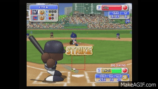

# Synopsis

*Yakyu VR* is a [course](https://sa.ucla.edu/ro/Public/SOC/Results/ClassDetail?term_cd=17S&subj_area_cd=COM%20SCI&crs_catlg_no=0174A%20%20%20&class_id=187720200&class_no=%20001%20%20)
project in development which creates a virtual reality of baseball based on
the video game series,
[*Power Pros*](https://en.wikipedia.org/wiki/Power_Pros), developed by
[Konami](https://us.konami.com/), a Japanese entertainment company. The goal
of this project is to give fans the opportunity to see the game from multiple
angles and perspectives of different players on the field.



Baseball fans usually do not get the opportunity to see exactly what the
players see on the field. They only get to see plays unfolding as a spectator
in the stands or a viewer at home from behind the television set. Moreover,
baseball video games, like
[*MLB Power Pros*](https://en.wikipedia.org/wiki/MLB_Power_Pros),
do not give gamers the option of playing from the vantage point of a particular
player, and only features gameplay from a third-person perspective.

# Development
The current graphics animation only displays a simulation of batting practice.
Continued development will focus on areas including a more robust collision
detection and response system, smoother motions abiding by physical laws, and
simulating an entire baseball game with the other position players included.
Most of the design will be modeled after that of Power Pros.

# Installation

Download or clone this repository. Please refer to the instructions in
**Usage** to run this locally.

# Usage
There are two options for using this graphics package.

1. Visit [https://viclai.github.io/Yakyu_VR/](https://viclai.github.io/Yakyu_VR/).
2. Run the graphics scene locally.

To run it locally, first make sure that you have Python installed on your
machine. Then, change directories to this downloaded or cloned repository
folder, and enter the following.

```
$ python -m SimpleHTTPServer
```

If you have Python 3.x, then run the following instead.

```
$ python3 -m http.server
```

The webpage will be served at `http://localhost:8000`.

# External Sources

The OBJ files and their respective textures used in this project are freely
available on the Web. They were downloaded from
[http://www.cadnav.com/](http://www.cadnav.com/) and
[https://opengameart.org/](https://opengameart.org/).
